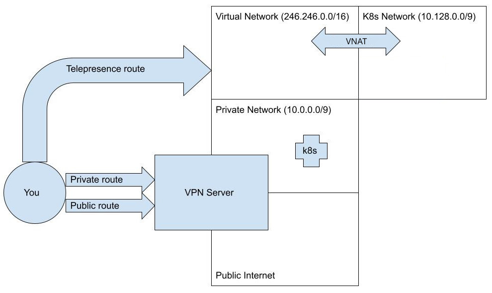
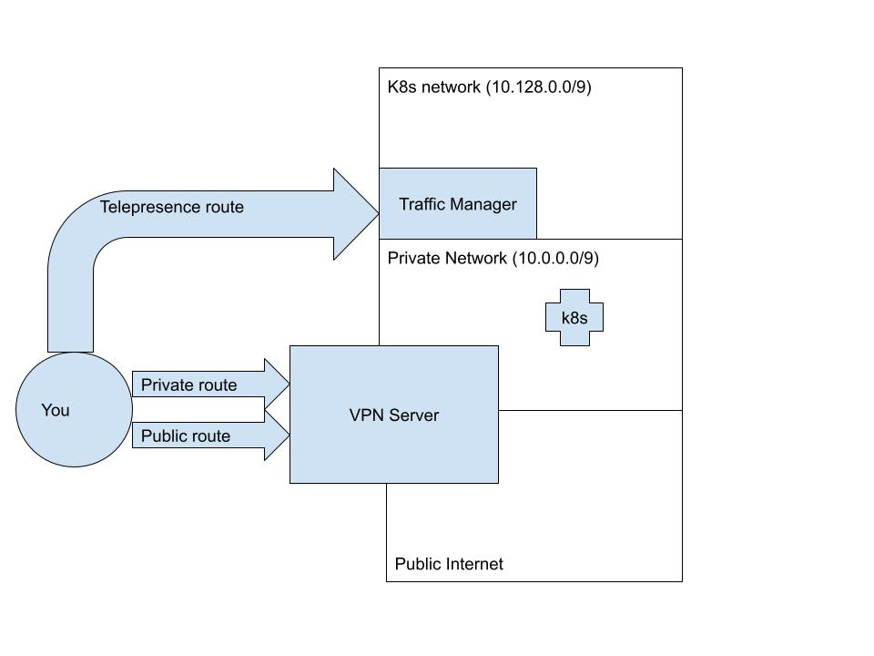

# Telepresence and VPNs

Telepresence creates a virtual network interface (VIF) when it connects. This VIF is configured to route the cluster's 
service subnet and pod subnets so that the user can access resources in the cluster. It's not uncommon that the
workstation where Telepresence runs already has network interfaces that route subnets that will overlap. Such
conflicts must be resolved deterministically.

Unless configured otherwise, Telepresence will resolve subnet conflicts by simply moving the cluster's subnet using
network address translation. For a majority of use-cases, this will be enough.

For more info, see the section on how to [avoid the conflict](#avoiding-the-conflict) below.

## VPN Configuration

Let's begin by reviewing what a VPN does and imagining a sample configuration that might come
to conflict with Telepresence.
Usually, a VPN client adds two kinds of routes to your machine when you connect.
The first serves to override your default route; in other words, it makes sure that packets
you send out to the public internet go through the private tunnel instead of your
ethernet or wifi adapter. We'll call this a `public VPN route`.
The second kind of route is a `private VPN route`. These are the routes that allow your
machine to access hosts inside the VPN that are not accessible to the public internet.
Generally speaking, this is a more circumscribed route that will connect your machine
only to reachable hosts on the private network, such as your Kubernetes API server.

This diagram represents what happens when you connect to a VPN, supposing that your
private network spans the CIDR range: `10.0.0.0/8`.


## Kubernetes configuration

One of the things a Kubernetes cluster does for you is assign IP addresses to pods and services.
This is one of the key elements of Kubernetes networking, as it allows applications on the cluster
to reach each other. When Telepresence connects you to the cluster, it will try to connect you
to the IP addresses that your cluster assigns to services and pods.
Cluster administrators can configure, on cluster creation, the CIDR ranges that the Kubernetes
cluster will place resources in. Let's imagine your cluster is configured to place services in
`10.130.0.0/16` and pods in `10.132.0.0/16`:


# Telepresence conflicts

When you run `telepresence connect` to connect to a cluster, it talks to the API server
to figure out what pod and service CIDRs it needs to map in your machine. If it detects
that these CIDR ranges are already mapped by a VPN's `private route`, it will produce an
error and inform you of the conflicting subnets:

```console
$ telepresence connect
telepresence connect: error: connector.Connect: failed to connect to root daemon: rpc error: code = Unknown desc = subnet 10.43.0.0/16 overlaps with existing route "10.0.0.0/8 via 10.0.0.0 dev utun4, gw 10.0.0.1"
```

Telepresence offers three different ways to resolve this:

- [Avoid the conflict](#avoiding-the-conflict) using the `--proxy-via` connect flag
- [Allow the conflict](#allowing-the-conflict) in a controlled manner
- [Use docker](#using-docker) to make telepresence run in a container with its own network config


## Avoiding the conflict

Telepresence can perform Virtual Network Address Translation (henceforth referred to as VNAT) of the cluster's subnets
when routing them from the workstation, thus moving those subnets so that conflicts are avoided. Unless configured not
to, Telepresence will use VNAT by default when it detects conflicts.

VNAT is enabled by passing a `--vnat` flag (introduced in Telepresence 2.21) to`teleprence connect`. When using this
flag, Telepresence will take the following  actions:

- The local DNS-server will translate any IP contained in a VNAT subnet to a virtual IP.
- All access to a virtual IP will be translated back to its original when routed to the cluster. 
- The container environment retrieved when using `ingest` or `intercept` will be mangled, so that all IPs contained
   in VNAT subnets are replaced with corresponding virtual IPs.

The `--vnat` flag can be repeated to make Telepresence translate more than one subnet.

```console
$ telepresence connect --vnat CIDR
```
The CIDR can also be a symbolic name that identifies a well-known subnet or list of subnets:

| Symbol    | Meaning                             |
|-----------|-------------------------------------|
| `also`    | All subnets added with --also-proxy |
| `service` | The cluster's service subnet        | 
| `pods`    | The cluster's pod subnets.          | 
| `all`     | All of the above.                   |


### Virtual Subnet Configuration

Telepresence will use a special subnet when it generates the virtual IPs that are used locally. On a Linux or macOS
workstation, this subnet will be a class E subnet (not normally used for any other purposes). On Windows, the class E is
not routed, and Telepresence will instead default to `211.55.48.0/20`.

The default subnet used can be overridden in the client configuration.

In `config.yml` on the workstation:
```yaml
routing:
  virtualSubnet: 100.10.20.0/24
```

Or as a Helm chart value to be applied on all clients:
```yaml
client:
  routing:
    virtualSubnet: 100.10.20.0/24
```

#### Example

Let's assume that we have a conflict between the cluster's subnets, all covered by the CIDR `10.124.0.0/9` and a VPN
using `10.0.0.0/9`. We avoid the conflict using:

```console
$ telepresence connect --vnat all
```

The cluster's subnets are now hidden behind a virtual subnet, and the resulting configuration will look like this:



### Proxying via a specific workload

Telepresence is capable of routing all traffic to a VNAT to a specific workload. This is particularly useful when the
cluster's DNS is configured with domains that resolve to loop-back addresses. This is sometimes the case when the
cluster uses a mesh configured to listen to a loopback address and then reroute from there.

The `--proxy-via` flag (introduced in Telepresenc 2.19) is similar to `--vnat`, but the argument must be in the form
CIDR=WORKLOAD. When using this flag, all traffic to the given CIDR will be routed via the given workstation.

The WORKLOAD is the deployment, replicaset, statefulset, or argo-rollout in the cluster whose traffic-agent will be used
for targeting the routed subnets.

#### Example

Let's assume that we have a conflict between the cluster's subnets, all covered by the CIDR `10.124.0.0/9` and a VPN
using `10.0.0.0/9`. We avoid the conflict using:

```console
$ telepresence connect --proxy-via all=echo
```

The cluster's subnets are now hidden behind a virtual subnet, and all traffic is routed to the echo workload.

### Caveats when using VNAT

Telepresence may not accurately detect cluster-side IP addresses being used by services running locally on a workstation
in certain scenarios. This limitation arises when local services obtain IP addresses from remote sources such as
databases or configmaps, or when IP addresses are sent to it in API calls.

### Disabling default VNAT

The default behavior of using VNAT to resolve conflicts can be disabled by adding the following to the client config. 

In `config.yml` on the workstation:
```yaml
routing:
  autoResolveConflicts: false
```

Or as a Helm chart value to be applied on all clients:
```yaml
client:
  routing:
    autoResolveConflicts: false
```

Explicitly allowing all conflicts will also effectively prevent the default VNAT behavior.

## Allowing the conflict

A conflict can be resolved by carefully considering what your network layout looks like, and then allow Telepresence to
override the conflicting subnets. Telepresence is refusing to map them, because mapping them could render certain hosts
that are inside the VPN completely unreachable. However, you (or your network admin) know better than anyone how hosts
are spread out inside your VPN.

Even if the private route routes ALL of `10.0.0.0/8`, it's possible that hosts are only being spun up in one of the
sub-blocks of the `/8` space. Let's say, for example, that you happen to know that all your hosts in the VPN are bunched
up in the first half of the space -- `10.0.0.0/9` (and that you know that any new hosts will only be assigned IP
addresses from the `/9` block). In this case you can configure Telepresence to override the other half of this CIDR
block, which is where the services and pods happen to be.

To do this, all you have to do is configure the `client.routing.allowConflictingSubnets` flag in the Telepresence helm
chart. You can do this directly via `telepresence helm upgrade`:

In `config.yml` on the workstation:
```yaml
routing:
  allowConflictingSubnets: 10.128.0.0/9
```

Or as a Helm chart configuration value to be applied on all clients:
```yaml
client:
  routing:
    allowConflictingSubnets: 10.128.0.0/9
```

Or pass the Helm chart configuration using the `--set` flag
```console
$ telepresence helm upgrade --set client.routing.allowConflictingSubnets="{10.128.0.0/9}"
```

The end result of this (assuming an allowlist of `/9`) will be a configuration like this:



### Using docker

Use `telepresence connect --docker` to make the Telepresence daemon containerized, which means that it has its own
network configuration and therefore no conflict with a VPN. Read more about docker [here](docker-run.md).
